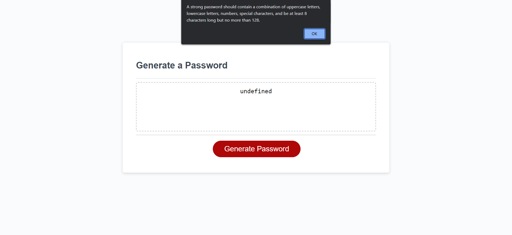
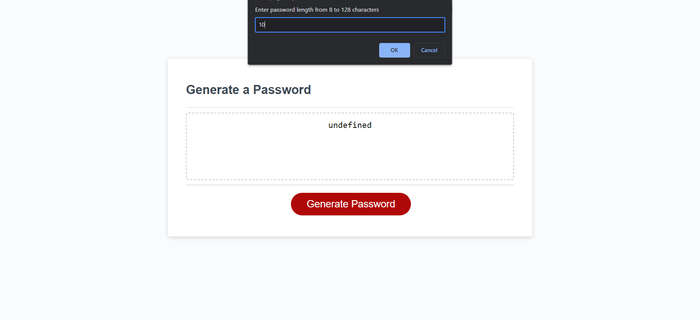
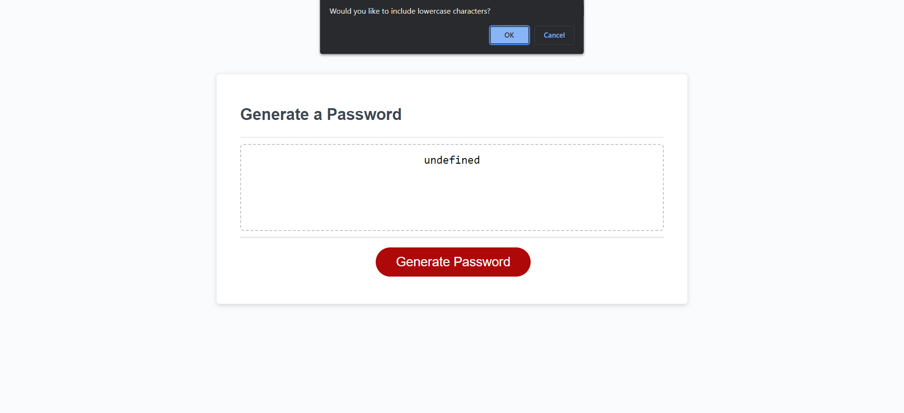
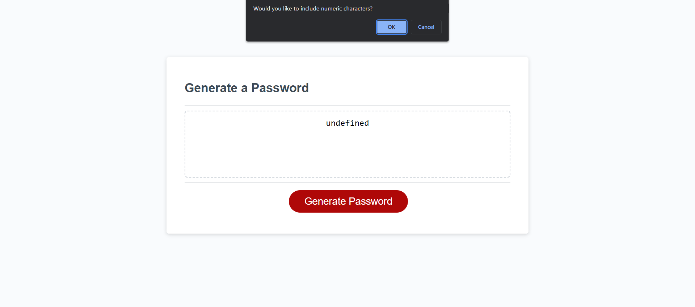
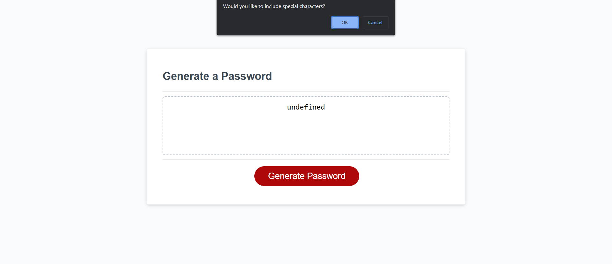
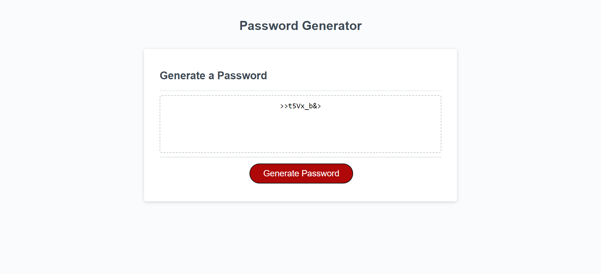

# random-pass-generator

## User Story
AS AN employee with access to sensitive data
I WANT to randomly generate a password that meets certain criteria
SO THAT I can create a strong password that provides greater security

## Acceptance Criteria

GIVEN I need a new, secure password
WHEN I click the button to generate a password
THEN I am presented with a series of prompts for password criteria
WHEN prompted for password criteria
THEN I select which criteria to include in the password
WHEN prompted for the length of the password
THEN I choose a length of at least 8 characters and no more than 128 characters
WHEN asked for character types to include in the password
THEN I confirm whether or not to include lowercase, uppercase, numeric, and/or special characters
WHEN I answer each prompt
THEN my input should be validated and at least one character type should be selected
WHEN all prompts are answered
THEN a password is generated that matches the selected criteria
WHEN the password is generated
THEN the password is either displayed in an alert or written to the page

## Description

You can use this website to create a random password for any login information that you may want or need. You will be recommended to pick a length of characters that you wante in your password. You can choose as little as 8 characters and as many 128 characters for your password length. You will be asked if you want to include lowercase, uppercase, numeric, and special characters in your password.

## Images
See images below of each prompt and a random password being generated

## Links
Github repository: https://github.com/allexortiz/random-pass-generator
Random Password Generator site: https://allexortiz.github.io/random-pass-generator/